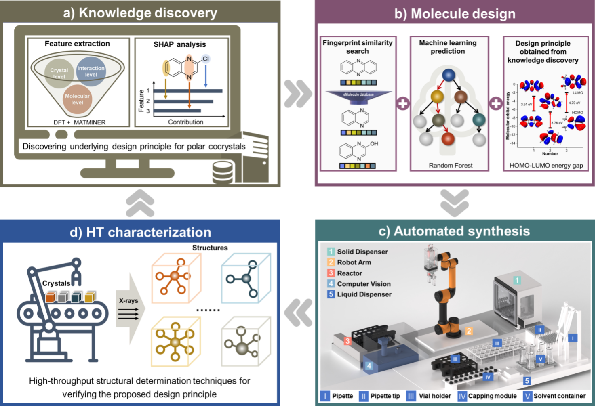
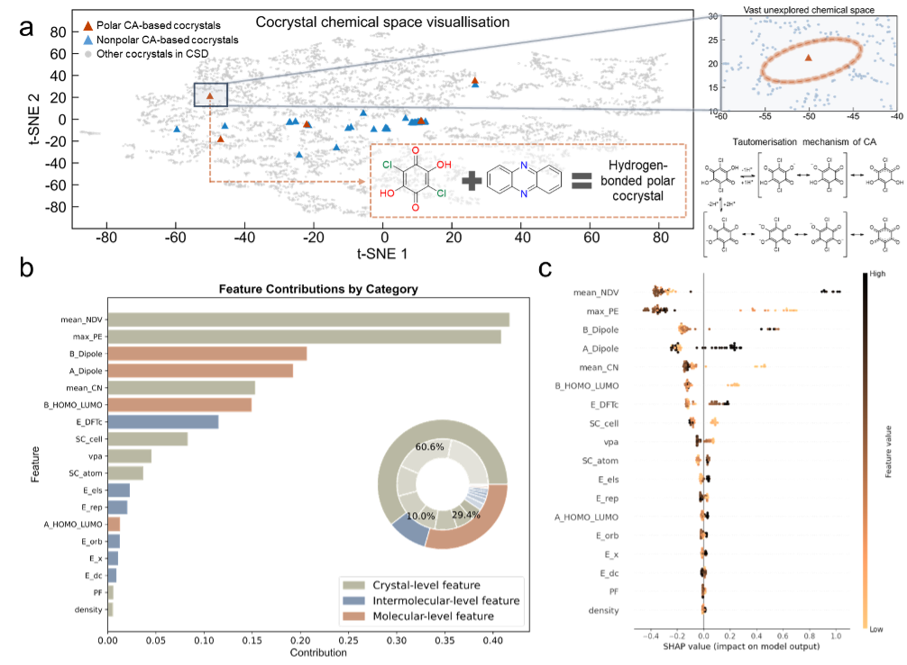

# **Data-driven Discovery of Polar Organic Cocrystals: Integration of Machine Learning and Automated Screening**





## **Summary**

This library consists of two parts: the Cocrystal prediction by machine learning section (using `Python 3.7`)  and the computer vision classification section (using `Python 3.10`). 

Corresponding scientific report:

## **Git Clone**

```sh
git clone https://github.com/Strathm0re/Cocrystal.git
```

## **Segment 1: Cocrystal Prediction Section**
### Installation
 
The code requires `python = 3.7, rdkit = 2023.3.2,  shap = 0.42.1, scikit-learn = 1.0.2, networkx = 2.6.3 and xgboost =1.6.2` . 

For more details, please check `requirements.txt`, under the folder Section1. 

Create venv: `conda create --name cocrystal python=3.7`

Activate venv: `conda activate cocrystal`
 
Install libraries: `pip install -r requirement.txt`



### Part 1 :Detailed methodology for t-SNE visualization of cocrystal chemical space

- This part corresponds to Section 2 of the Supplementary Information.

This section includes details of t-SNE visualization. Here, to investigate the chemical spaces related to CA (63 records) and Cocrystals (7655 records), we utilize a hybrid dataset (7718 records in total). 

The embeddings generated by a fine-tuned MOLCLR model are employed (`embedding_MolCLR.csv`), and t-SNE is applied to characterize the chemical spaces (detailed information at `tsne_cocrystals.ipynb`).

While t-SNE results may show slight variations due to the stochastic nature of the algorithm, the overall structure and patterns in the data remain consistent. 
The vast unexplored chemical space is a significant and clear feature of the data, representing the many potential compounds that are yet to be discovered. 

### Part 2: ML prediction and SHAP analysis: unveiling feature contributions to cocrystal formation

- This part corresponds to Section 4 of the Supplementary Information.

This section includes details of Shapley Analysis, which mainly encompasses three aspects: Testing of three different classification models along with their respective hyperparameter optimization using grid search CV, SHAP force plots for several typical cocrystals and Analysis of the importance of descriptor features. 

For more information, please refer to `ca_XGBoost.ipynb`.

The section details that the 18 features of cocrystals are stored in the file `merged_features_original_18.csv`.


### Part 3: Cocrystal prediction by machine learning 

- This part corresponds to Section 7 of the Supplementary Information.


This section includes details on predicting the two coformers of a given cocrystal. For more information, please refer to `cocrystal_prediction.ipynb` 

 - 7655 positive records are stored in `maccs_fingerprints.csv`
 - 7655 negative records are stored in `negative_samples.csv`
 - MACCS fingerprints for negative records are stored in `negative_samples_maccs.csv`

### Part 4: Cocrystal distance map(centered with CA)

- This part corresponds to Section 8 of the Supplementary Information.

Details on the generation of Figure 2 is stored in the directory "Cocrystal_distance_map" (centered with CA), and the detailed generation process of the figure can be found in the notebook "`chemical_distance_map.ipynb`". 

The information related to 56 molecules is stored in the file "`CA_pcc_homolumo.csv`".


## **Segment 2: Computer Vision Classification using ResNet-18**
### Prerequisites 

 - Linux 
 - PyTorch  
 - NVIDIA GPU

### Installation 
The code requires `python=3.10, as well as torch=2.4.0 and torchvision=0.19.0`. Please follow the instructions here to install both PyTorch and TorchVision dependencies.

For more information, check the `requirements.txt` under the folder `./Section2/Powder_SingleCrystal_Liquid_ResNet18`

Create venv: `conda create --name cocrystal_cv python=3.10`

Activate venv: `conda activate cocrystal_cv`

Install libraries: `pip install -r requirements.txt`

### Training and evaluation 

 - Train ResNet-18 model: `train.py`  
 - Test ResNet-18 model: `test.py`

ImagePrediction The model checkpoint can be acquired from the folder named checkpoint. `image->type image_path = file_dir + r"/sample/Crystal4.JPG"`

predicted_class, predicted_label = predict_image(image_path) Please see `prediction_img.ipynb` for more details.
## Citation


## Reference

 - J.-J. Devogelaer, H. Meekes, P. Tinnemans, E. Vlieg, R. de Gelder,   Angew. Chem. Int. Ed. 2020, 59, 21711.
 - Wang, D., Yang, Z., Zhu, B., Mei, X. & Luo, X. Machine-learning-guided cocrystal prediction based on large data base. Cryst. Growth Des. 20, 6610–6621 (2020).
 - Ward L., Dunn A., Faghaninia A., Zimmermann N., Bajaj S., Wang Q., Montoya J., Chen J., Bystrom K., Dylla M., Chard K., Asta M., Persson K., Snyder G., Foster I., Jain A.
Comput. Mater. Sci., 0927-0256, 152 (2018), pp. 60-69
 - He, K., Zhang, X., Ren, S., & Sun, J. (2015). Deep Residual Learning for Image Recognition. 2016 IEEE Conference on Computer Vision and Pattern Recognition (CVPR), 770-778. 
 - Zhang, A., Lipton, Z. C., Li,    M., & Smola, A. J. (2023). Dive into Deep Learning. Cambridge    University Press. https://D2L.ai

## Contact 
Feel free to contact us if there is any question: `yumy2022@shanghaitech.edu.cn`, `963484038@qq.com` 
or create "issues"


