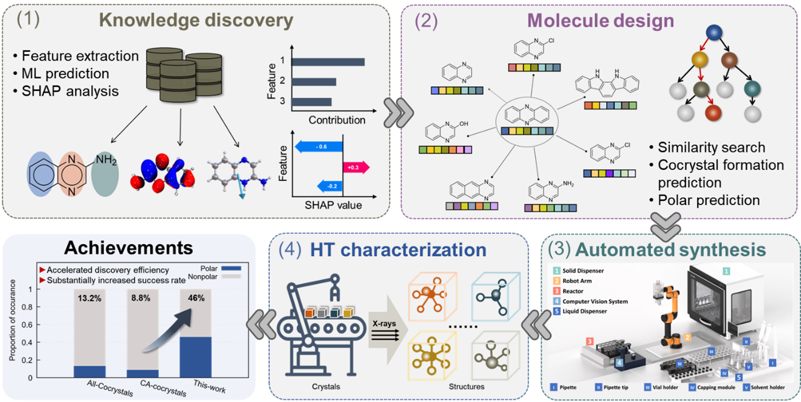
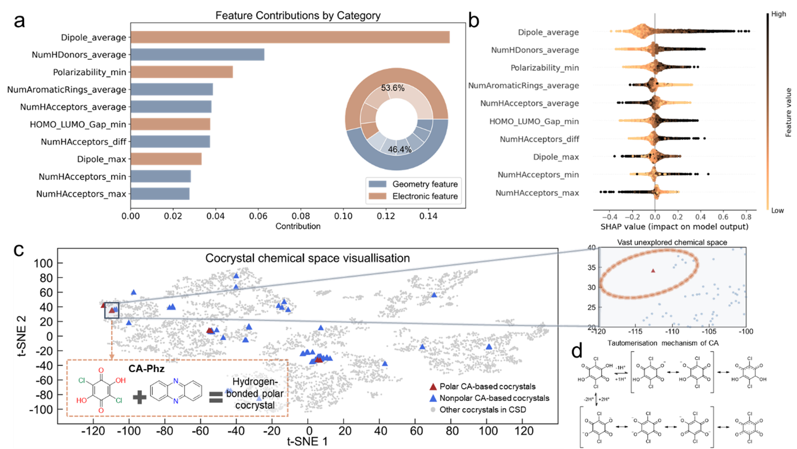

# **Data-driven Discovery of Polar Organic Cocrystals: Integration of Machine Learning and Automated Screening**





## **Summary**

This library consists of two parts: the Cocrystal prediction by machine learning section (using `Python 3.9`)  and the computer vision classification section (using `Python 3.10 `). 

Corresponding scientific report:

## **Git Clone**

```sh
git clone https://xxxxxxx.git
```

## **Segment 1: Cocrystal Prediction Section**
### Installation
 
The code requires `python = 3.9, rdkit = 2025.03.4,  autogluon.tabular = 1.3.0, shap = 0.48.0, networkx = 2.6.3, csd python api= 3.4.1 ` . 

For more details, please check `requirements.txt`, under the folder Section1. 

Create venv: `conda create --name cocrystal python=3.9`

Activate venv: `conda activate cocrystal`

Conda Install CCDC python api : `conda install --channel=https://conda.ccdc.cam.ac.uk csd-python-api` 

Install AutoGluon: `pip install --upgrade pip setuptools wheel`, `pip install autogluon.tabular[all]`

Conda Install RDKit: `conda install -c conda-forge rdkit`
 
Install the rest libraries: `pip install -r requirement.txt`



### Part 1 :Detailed methodology for t-SNE visualization of cocrystal chemical space

- This part corresponds to Section 2 of the Supplementary Information.

This section includes details of t-SNE visualization. Here, to investigate the chemical spaces related to CA based cocrystals and other cocrystals , we utilize a hybrid dataset . 

The embeddings generated by a fine-tuned MOLCLR model are employed (`embedding_MolCLR.csv`), and t-SNE is applied to characterize the chemical spaces (detailed information at `tsne generation.ipynb`).


### Part 2: ML prediction and SHAP analysis: unveiling feature contributions to cocrystal formation

- This part corresponds to Section 3 of the Supplementary Information.

This section details the training process of AutoGluon models, with a specific focus on the impact of different temperature ranges on model performance.

For more information, please refer to `Autogluon_Formation_Prediction.ipynb`. The file contains two part, Negative Generation and Model Training Part.

The dataset that marks dataset#2 Supplementary Information refers to the file `./original/training_dataset.csv`. Under the `original folder`, the negative samples refers to the file `original_negative_samples_ionic.csv` and `original_negative_samples_neutral.csv`


### Part 3: Cocrystal prediction by machine learning 

- This part corresponds to Section 4 and Section 5 of the Supplementary Information.

This section includes details on predicting the possibility of being polar for a given cocrystal. For more information, please refer to `AutoGluon_Polarity_Prediction.ipynb` 

- The file `Large_Scale_dataset.csv` is the input file for the training process.
- The file `candidate_probability_predictions.csv` contains the final prediction results for candidate cocrystals.
- The folder `plot_69samples_dependence_plot` contain dependence plots for 69 CA-based cocrystals based on the shapley analysis.
- The folder `shap_plots` contain beeswarm plots and bar plots based on the shapley analysis
## **Segment 2: Computer Vision Classification using ResNet-18**
### Prerequisites 

 - Linux 
 - PyTorch  
 - NVIDIA GPU

### Installation 
The code requires **python=3.10, as well as torch=2.4.0 and torchvision=0.19.0.** Please follow the instructions here to install both PyTorch and TorchVision dependencies.

For more information, check the `requirements.txt` under the folder `./Section2/Powder_SingleCrystal_Liquid_ResNet18`

Create venv: `conda create --name cocrystal_cv python=3.10`

Activate venv: `conda activate cocrystal_cv`

Install libraries: `pip install -r requirements.txt`

### Training and evaluation 

 - Train ResNet-18 model: `train.py`  
 - Test ResNet-18 model: `test.py`

ImagePrediction The model checkpoint can be acquired from the folder named checkpoint. `image->type image_path = file_dir + r"/sample/Crystal4.JPG"`

predicted_class, predicted_label = predict_image(image_path) Please see `prediction_img.ipynb` for more details.
## Citation


## Reference

 - J.-J. Devogelaer, H. Meekes, P. Tinnemans, E. Vlieg, R. de Gelder,   Angew. Chem. Int. Ed. 2020, 59, 21711.
 - Wang, D., Yang, Z., Zhu, B., Mei, X. & Luo, X. Machine-learning-guided cocrystal prediction based on large data base. Cryst. Growth Des. 20, 6610–6621 (2020).
 - Ward L., Dunn A., Faghaninia A., Zimmermann N., Bajaj S., Wang Q., Montoya J., Chen J., Bystrom K., Dylla M., Chard K., Asta M., Persson K., Snyder G., Foster I., Jain A.
Comput. Mater. Sci., 0927-0256, 152 (2018), pp. 60-69
 - He, K., Zhang, X., Ren, S., & Sun, J. (2015). Deep Residual Learning for Image Recognition. 2016 IEEE Conference on Computer Vision and Pattern Recognition (CVPR), 770-778. 
 - Zhang, A., Lipton, Z. C., Li,    M., & Smola, A. J. (2023). Dive into Deep Learning. Cambridge    University Press. https://D2L.ai

## Contact 
Feel free to contact us if there is any question: `yumy2022@shanghaitech.edu.cn`, `963484038@qq.com` 
or create "issues"


